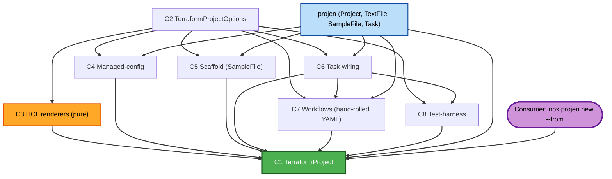

# Component Dependencies — projen-terraform

## Dependency Matrix

| Component | Depends on | Consumed by |
|---|---|---|
| C2 `TerraformProjectOptions` | (none) | C1, C3, C4, C6, C7, C8 |
| C3 HCL renderers | C2 (types) | C1 |
| C4 Managed-config | projen `TextFile`, C2 | C1 |
| C5 Scaffold | projen `SampleFile`/`SampleDir`, C2 | C1 |
| C6 Task wiring | projen `Task`, C2 | C1, C7 (workflows call tasks) |
| C7 Workflows | projen `TextFile`, C2, C6 (task names) | C1 |
| C8 Test-harness | projen `SampleFile`, C2, C6 (`test` task) | C1 |
| C1 `TerraformProject` | projen `Project`, C2–C8 | end consumer |

No cycles. C1 is the only composition root; C3 is pure (no projen dependency), which is
what makes it cleanly property-testable (NFR-4).

## Dependency Diagram

## Communication Patterns
- **In-process, synchronous**: all wiring is constructor calls at synth time. No network, no IPC.
- **Data flow**: `options` (plain object) flows down; components return `void` (they mutate the projen file tree) except C3 renderers which return strings.
- **Tool invocation** (runtime, not synth): tasks (C6) shell out to bare binaries on PATH (Q4); workflows (C7) install those binaries via setup actions before running tasks.

## Build / packaging dependencies
- The project type itself is a TypeScript npm package (Node 22, npm), unit-tested with Jest; C3 additionally property-tested. Published to npm for `--from` consumption (Q4 distribution).
