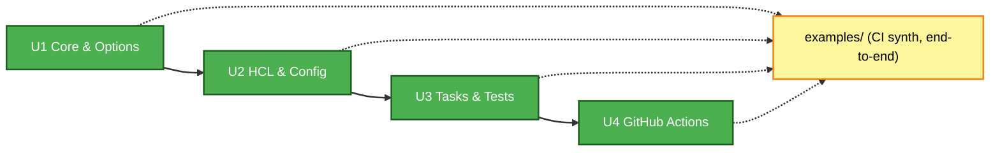

# Unit of Work Dependencies — projen-terraform

## Dependency Matrix

| Unit | Depends on | Reason | Blocks |
|---|---|---|---|
| U1 Core & Options | projen `Project` | composition root | U2, U3, U4 |
| U2 HCL & Config | U1 (options/types, project handle) | renderers/generators consume resolved options | U3 (task `docs`/`validate` target files), U4 |
| U3 Tasks & Tests | U1, U2 (files must exist to fmt/validate/docs) | tasks operate on emitted files | U4 (workflows invoke `npx projen build`/`test`) |
| U4 Workflows | U1, U3 (task names) | CI calls the tasks | — (terminal) |

Linear chain, no cycles: **U1 → U2 → U3 → U4**.

## Diagram

## Integration / Coordination
- **Shared contract**: `TerraformProjectOptions` (U1) is the single interface all later units read from — version it carefully.
- **Integration point**: the `examples/` project (planning Q5=A) synthesizes the whole package end-to-end in CI; it is the integration test that exercises U1–U4 together and validates idempotency (re-synth = zero diff).
- **Testing checkpoints**: U2 renderers property-tested in isolation; full-package Jest snapshot of `examples/` output after each unit lands.
