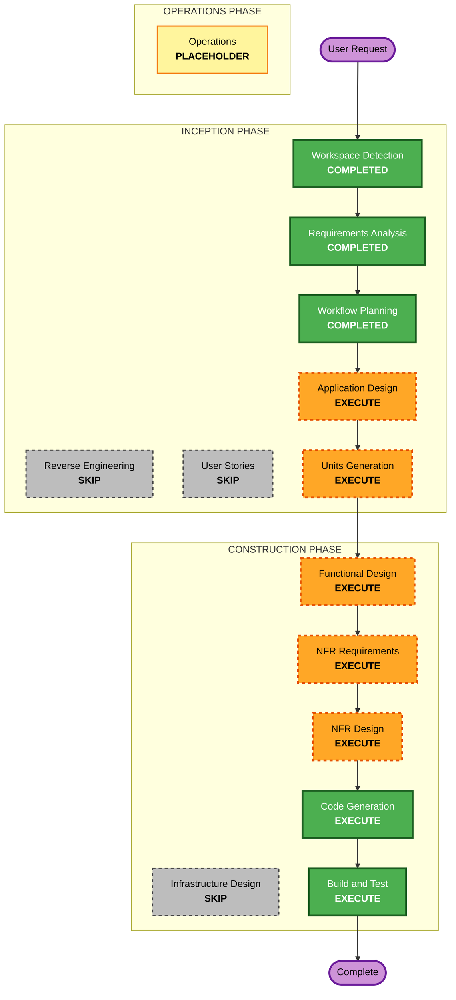

# Execution Plan — projen-terraform

## Detailed Analysis Summary

### Change Impact Assessment
- **User-facing changes**: No (developer-tooling; the "users" are engineers consuming the project type — no end-user UI)
- **Structural changes**: Yes — defines a new projen project type and component architecture from scratch
- **Data model changes**: No (no persistence; "data" is the projen options object and rendered file content)
- **API changes**: Yes — the public surface is the `TerraformProject` options interface consumed via `npx projen new --from`
- **NFR impact**: Yes — Security Baseline (blocking), Property-Based Testing (partial), Resiliency (directional) all enabled

### Risk Assessment
- **Risk Level**: Medium
- **Rollback Complexity**: Easy (greenfield; no production system, no data migration)
- **Testing Complexity**: Moderate (idempotent synthesis + faithful reproduction of the self-mutation CI pattern for a non-native projen project type; property tests on HCL renderers)

## Workflow Visualization

## Phases to Execute

### 🔵 INCEPTION PHASE
- [x] Workspace Detection (COMPLETED)
- [x] Reverse Engineering (SKIPPED — greenfield)
- [x] Requirements Analysis (COMPLETED)
- [x] User Stories (SKIPPED — single primary persona, no end-user UI)
- [x] Workflow Planning (IN PROGRESS)
- [ ] Application Design — **EXECUTE**
  - **Rationale**: A new component architecture must be defined — `TerraformProject`, the HCL renderers, the tooling-config generators, and the GitHub Actions generators. Their boundaries, options interface, and dependencies need design.
- [ ] Units Generation — **EXECUTE**
  - **Rationale**: The work decomposes into cohesive units (project-type core, HCL/config file generators, GitHub Actions trio, test-harness wiring) that can be designed and built independently.

### 🟢 CONSTRUCTION PHASE
- [ ] Functional Design — **EXECUTE**
  - **Rationale**: Non-trivial logic — idempotent HCL rendering, the self-mutation patch/apply flow, and option→file mapping — needs functional design per unit.
- [ ] NFR Requirements — **EXECUTE**
  - **Rationale**: Security Baseline is a blocking extension; supply-chain pinning, least-privilege workflow tokens, and PBT targets must be captured as NFRs.
- [ ] NFR Design — **EXECUTE**
  - **Rationale**: NFR Requirements executes, so the patterns (version pinning strategy, token handling, property-test design for renderers) need design.
- [ ] Infrastructure Design — **SKIP**
  - **Rationale**: This tool deploys no cloud infrastructure of its own. It *generates* a `backend.tf` scaffold (config only, no provisioning), which is covered under Functional Design for the relevant unit. No deployment architecture to design.
- [ ] Code Generation — **EXECUTE (ALWAYS)**
  - **Rationale**: The project type, generators, workflows, and tests must be implemented.
- [ ] Build and Test — **EXECUTE (ALWAYS)**
  - **Rationale**: Verify idempotent synth, run Jest on synthesis logic + property tests, and confirm the generated repo's `build`/`upgrade`/`pull-request-lint` behave like the CDK reference.

### 🟡 OPERATIONS PHASE
- [ ] Operations — PLACEHOLDER

## Estimated Timeline
- **Total stages to execute**: 7 (2 Inception + 5 Construction, Infrastructure Design skipped)
- **Estimated Duration**: design-doc focus — Inception design stages are the immediate deliverable; Construction follows on approval.

## Success Criteria
- **Primary Goal**: A complete, approved design for `projen-terraform` that an engineer can implement to produce a published projen project type scaffolding governed Terraform repos.
- **Key Deliverables**: component architecture, units of work, functional + NFR designs, then implementation and tests.
- **Quality Gates**: idempotent `npx projen` (zero diff on re-run); generated `build`/`upgrade`/`pull-request-lint` match CDK reference behavior; tfsec + checkov + tflint + `validate` + `fmt -check` all block in CI; Security Baseline compliance summary clean at each stage.
